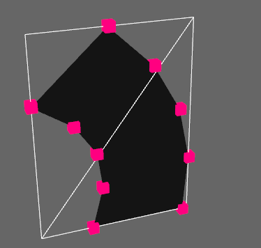

# bevy_mod_mesh_tools

Use with bevy 0.16.

## Compute the Aabb of a skinned mesh



*skinned.rs example*

## Simple example showing how to combine multiple meshes, with transforms:

```rust
use bevy::prelude::*;
use bevy_mod_mesh_tools::{mesh_append, mesh_with_transform};

fn setup(mut commands: Commands, mut meshes: ResMut<Assets<Mesh>>) {
    let cube_mesh = shape::Cube::default().into();
    let sphere_mesh = shape::UVSphere::default().into();

    let mut mesh_a = mesh_with_transform(&cube_mesh, &Transform::from_xyz(-2.0, 0.0, 0.0)).unwrap();
    let mesh_b = mesh_with_transform(&sphere_mesh, &Transform::from_xyz(2.0, 0.0, 0.0)).unwrap();

    mesh_append(&mut mesh_a, &mesh_b).unwrap();

    commands.spawn(PbrBundle {
        mesh: meshes.add(mesh_a),
        ..default()
    });

    commands.spawn(Camera3dBundle {
        transform: Transform::from_xyz(0.0, 6., 12.0).looking_at(Vec3::new(0., 1., 0.), Vec3::Y),
        ..default()
    });
}

fn main() {
    App::new()
        .add_plugins(DefaultPlugins)
        .add_systems(Startup, setup)
        .run();
}
```
*combine_meshes_simple.rs example*